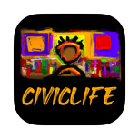
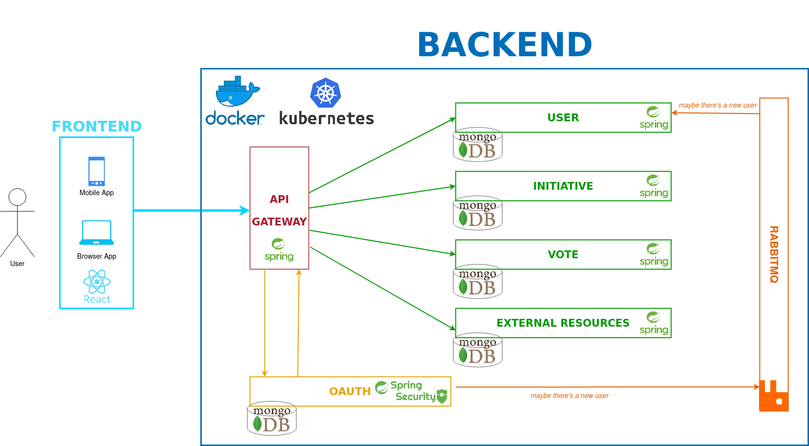

# CivicLife

CivicLife is a Spring Application made for the [Tecniche e architetture avanzate per lo sviluppo del software](http://magistrale.educ.di.unito.it/index.php/offerta-formativa/insegnamenti/elenco-completo/elenco-completo/scheda-insegnamento?cod=INF0100&codA=&year=2022&orienta=X) exam in the master's degree in computer science at [UniTO](https://www.unito.it). It is a toy application that offers to a citizen the ability to manage his **civic life**. With these application 3 main operations could be performed:

1. Retrieve personal information about:
	- administered and certified vaccines;
	- state bonuses such as the educational ones that can bring some privileges to students in performing some activities;
2. Create/Subscribe/Unsubscribe/Delete civic initiatives. Indeed the people can use the application to create initiative and organize with each other about civic issue that they care about such as: 
	- volunteering
	- increase social events in a neighborhood
	- etc.
3. Voting

# Documentation

All the documentation that we have produced is in the [documentation folder](./documentation). Here you can find the incremental project reviews slides and all the other files associated with the project that we have updated since november.

# Architectural Design

The application has a microservice architecture made with Spring and React. Without boring you much here this is an image that sumps up some ideas: 

# Data

To test the application with some default data you can use the following link to a [postman collection](https://www.postman.com/dark-zodiac-810044/workspace/civiclife/collection/24079070-e138ff55-2c96-46a7-bb67-bff65ca58da0?action=share&creator=24079070) and click on `run collection` in the drop down menu that appears after pressing the *three dot* icon in your Postman desktop app. The POST methods that will be run by doing so are the ones containing the data expressed in the [data folder](./data). Obviously you have to start and run the application before, and so...

# How to run it

The application could run as a docker or kubernetes project. All the microservices images will be downloaded from the [Docker Hub](https://hub.docker.com/repository/docker/lorenzos98/civiclife/general) repository

## Docker

To run all the containers all you have to do is to go to the [code folder](./code) and do the following command: 

`docker compose up`

and then:

`docker compose down --rmi all --volumes`

to stop all the containers and remove the containers, networks, volumes, and images created by the *up* command.

## Kubernetes

To run all the pods each within its own node, go to the [k8s folder](./code/k8s) and run:

`minikube start`

`kubectl apply -f .`

To see everything running use:

`kubectl get all`
 
Then, to stop and delete everything:

`kubectl delete all --all`

